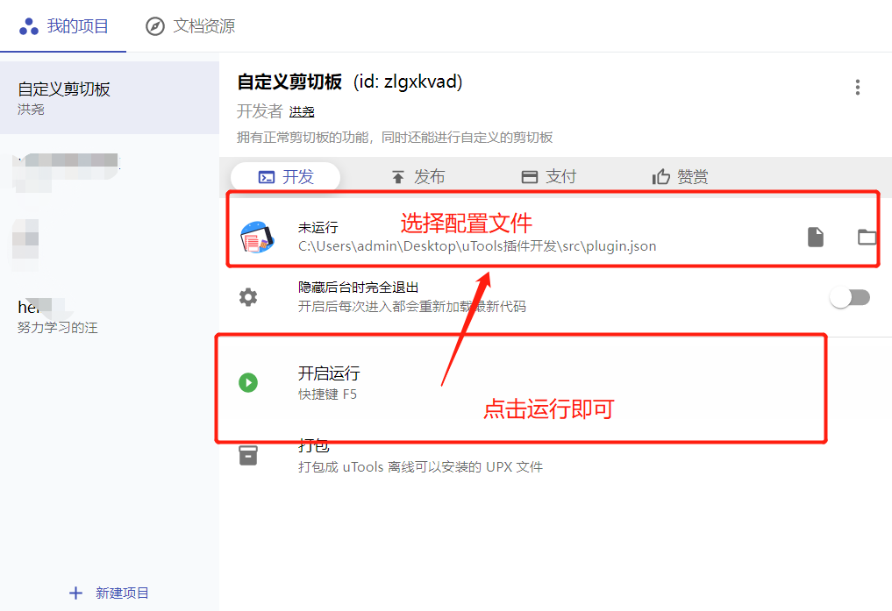
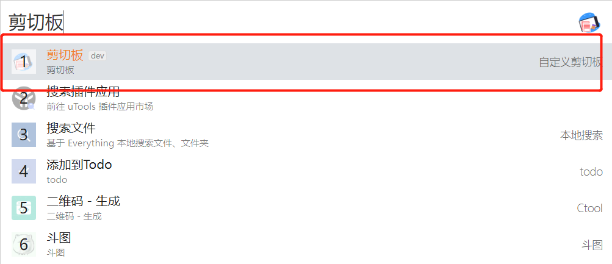
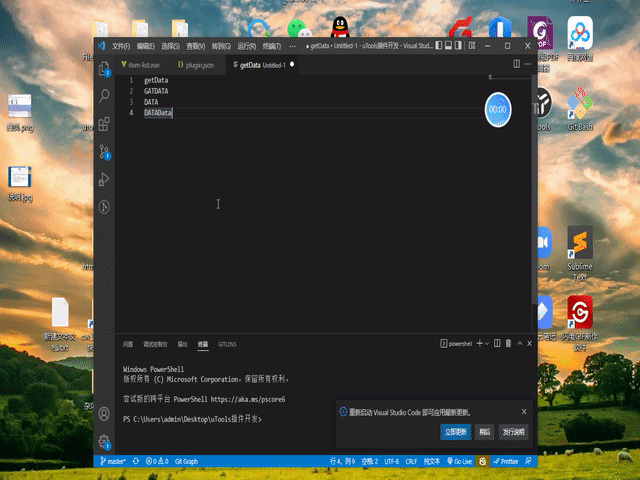
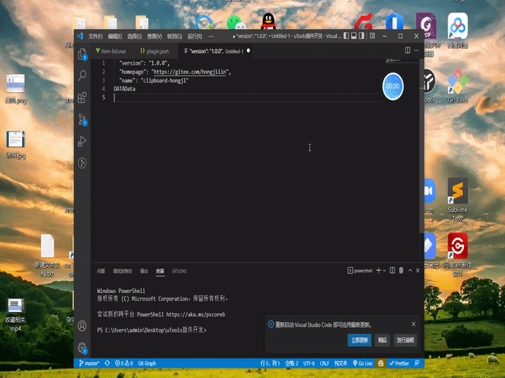
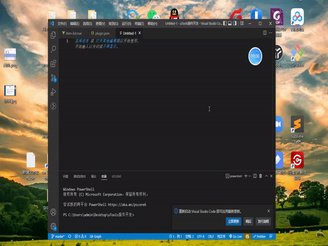
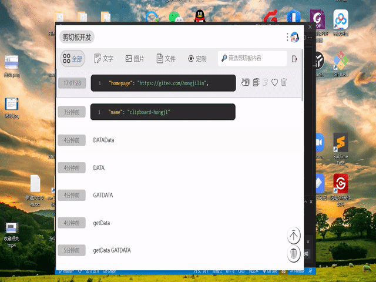

# uTools剪切板插件

>本人学习笔记分享：https://gitee.com/hongjilin/hongs-study-notes
>
>本人疫情防控管理系统项目分享：https://github.com/Hongjilin/Campus-epidemic-prevention-and-control-syste

### 一、介绍
> 洪uTools剪切板插件开发，主要给自己身边的朋友使用,本人996,所以开发的时间会较少,所以插件的功能将会是逐渐完善的一个过程
>

#### 为甚么开发？

>​	作为一个喜爱uTools的用户来说，并不是说鼓励大家白嫖，只是本人因为喜爱uTools软件并且跟身边人进行了推广，结果身边人习惯上使用【剪切板】插件后（因为本人最喜欢这个功能，疯狂安利了），官方转而要对此插件进行收费。使得我有点不好意思，就萌生了写一个插件自己以及身边的人使用，能学习到东西的同时还能方便身边的人
>
>​	其实呢，如果用的很习惯uTools冲个会员也是很好，它里面有很多不错的插件，不仅仅是一个剪切板(而且官方的剪切版确实好用)。要不然我和我朋友就不会依赖上uTools的剪切板了。但主要还是我身边好多朋友甚至还有在校学生,可能经济实力不好,所以开发了一个自用,大家觉得好用就用,觉得不好用也可以提出建议或者找其他同类插件(其实剪切板就这点功能,平替很多的),我会参考进行优化

#### 技术选型

> 1. vue：手动引入了vue进行了页面的定制化开发，实际上可以直接Html5进行开发，但毕竟工作中Vue用的比较顺手，就想办法引入了vue进行开发
> 2. js： 基本上都是靠着js基础进行的插件开发，所以其实初学者都能开发的，uTools官方提供了很多很齐全的api
>
> ##### 思路：
>
> 

#### 项目目录说明

> 项目功能代码都在`src`文件目录下
>
> ##### 文件说明：
>
> >1. `plugin.json`  --uTools项目配置
> >2. `index.html`   --不使用uTools默认的模板配置文件，而是在【plugin.json】中使用此模板，定制化自己的uTools页面
> >3. `index.js`     --Vue的入口文件，相当于vue项目的main.js，初始化vue项目
> >4. `preload.js`   --当你在 plugin.json 中配置了 preload 属性，将载入对应的预加载脚本，它是一个特殊且单独的文件，不需要与其他业务代码编译在一起，在此文件中可以访问 nodejs、electron、uTools 提供的 api，并挂载到 window 对象中，你其他的普通 javascript 代码就可以访问这些 api。
>
> ##### 文件夹说明
>
> >1. `lib文件夹`    --里面放入外部引入的依赖文件(也可以自己npm下载)，这里直接从官网下载对象的js文件放到这里，主要用到vue.js
> >2. `model文件夹`  --里面放置自己封装的uTools初始化DB数据库的js代码
> >3. `utils文件夹`  --里面放置自己封装的工具函数
> >4. `views文件夹`  --里面放置vue组件，定制化界面的
> >5. `config文件夹` --里面放置项目通用配置，一些常见的需要统一修改的数据就放到这里面，方便统一修改

### 二、怎么运行

>可以直接看官方文档 --》[点我传送](https://u.tools/docs/developer/welcome.html#%E5%BC%80%E5%8F%91%E8%80%85%E4%B8%AD%E5%BF%83)
>
>1. 先在uTools中下载【uTools开发者工具】，随后随便创建一个项目
>
>2. 选择项目中的 src-->`plugin.json`，随后点击运行即可
>
>    
>
>3. 随后就可以根据关键字呼出本地文件
>
> 

### 三、项目效果（截取自V1.0.9版本）

> 截取了部分功能到此，完整功能不止这些，只是为了方便大家查看效果

#### Ⅰ - 剪切板文件类型的复制与预览

> 

#### Ⅱ - 文字文本的剪切

> 

#### Ⅲ - 图片的剪切

> 

#### Ⅳ - 剪切板筛选

> 

#### Ⅴ - 懒加载

> 

#### Ⅵ - 多选文本聚合粘贴

> 

#### Ⅶ - 收藏相关

> 

#### Ⅷ - 删除清空相关

> 
